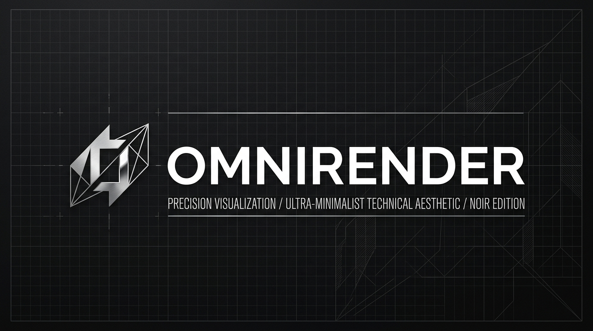

<div align="center">



# OmniRender

**Out-of-process neural graphics and temporal reconstruction engine for 3D games (DirectX 8/9/10/11, OpenGL, Vulkan).**

[](./LICENSE)
[]()
[](./CMakeLists.txt)
[](./CHANGELOG.md)
[](https://github.com/GuruMachanica/OmniRender)

</div>

---

> **v0.7.0-alpha adds OpenGL capture & dynamic PE-import detection.** When
> `omnirender-hook.dll` is renamed to `opengl32.dll` (or `d3d9.dll` / `dxgi.dll`) and dropped
> into a game's folder, the proxy intercepts rendering calls, extracts shared surface handles
> with zero GPU memory copies, and publishes frames through a lock-free SPSC ring buffer.
> The daemon performs temporal reconstruction, AI upscaling (DLSS, FSR, XeSS), and ray tracing out-of-process.

OmniRender is an experimental out-of-process rendering compatibility
layer. The architecture (in-process proxy DLL + 64-bit daemon +
shared-memory ring + DXGI shared handles) is real; the long-term
goal is temporal reconstruction, upscaling, and image-quality
enhancement for DirectX 9/10/11 titles. We are building it
incrementally, version by version.

| | |
|---|---|
| **Target OS** | Windows 10 21H2 / Windows 11 |
| **Architecture** | `omnirender-hook.dll` (x86/x64) + `OmniRenderDaemon.exe` (x64) |
| **Toolchain** | Visual Studio 2022 (MSVC v143), CMake ≥ 3.20 |
| **SDKs** | Windows 10/11 SDK · DirectX Shader Compiler · NVIDIA Streamline / NGX *(optional, off by default)* · TensorRT 10.x *(optional, off by default)* |
| **License** | [GNU General Public License v3.0 (GPLv3)](./LICENSE) |

---

## Features & Implementation Status

| Feature | Status | Description |
|---|---|---|
| **OmniRender Control Center** | `[PROD]` | Native Win32 desktop GUI (`OmniRenderControlPanel.exe`) with PE-based graphics API detection and single-click launch. |
| **DXGI Shared Handles Interop** | `[PROD]` | Zero-copy GPU resource transfer between hook and daemon with crash isolation (NFR-2). |
| **D3D9 & OpenGL VTable Hooking** | `[PROD]` | In-process proxy DLL with automatic API detection and zero-copy `WGL_NV_DX_interop2` OpenGL bridge. |
| **Lock-Free SPSC Ring Buffer** | `[PROD]` | Single-producer single-consumer shared-memory ring buffer with acquire/release memory ordering. |
| **AMD FSR 1.0 (EASU + RCAS)** | `[PROD]` | Standalone Direct3D 11 compute shaders for spatial upscaling and sharpening with zero external dependencies. |
| **GPU Timestamp Profiler** | `[PROD]` | Double-buffered Direct3D 11 hardware timestamp query ring measuring exact GPU stage execution latencies. |
| **Interactive Frame Debugger (`F12`)** | `[PROD]` | Real-time viewport channel switcher: Output, Color, Depth, Motion Vectors, Reactive Mask, Disocclusion, History. |
| **Waitable Swapchain & Telemetry HUD (`F11`)** | `[PROD]` | DXGI 1.3 low-latency waitable object presentation with toggleable on-screen diagnostic telemetry overlay. |
| **3x3 YCoCg Temporal Accumulation** | `[EXPERIMENTAL]` | Direct3D 11 compute shader featuring YCoCg color space clipping, AABB ray clipping, and reactive mask weighting. |
| **Geometric Disocclusion Pass** | `[EXPERIMENTAL]` | Depth difference comparison against reprojected history to reject disoccluded pixels. |
| **Camera Reprojection Motion Vectors** | `[EXPERIMENTAL]` | Depth-based motion vector synthesis with CPU-precomputed matrix inversion. |
| **Screen-Space Ray Tracing (SSRT)** | `[EXPERIMENTAL]` | Depth-buffer ray-marched screen-space reflections (SSR) and contact ambient occlusion (RTAO). |
| **Auto HDR Tonemapper** | `[EXPERIMENTAL]` | Reinhard extended luma-preserving tone compression compute kernel. |
| **NVIDIA DLSS & Intel XeSS Loaders** | `[ADAPTER]` | Dynamic runtime loader for Streamline / NGX and XeSS; gracefully falls back to native FSR when unavailable. |
| **Optical Flow Motion Vector Engine** | `[PLANNED]` | Hardware-accelerated dense optical flow (NVIDIA OFA / DirectX) for games without depth buffers. |

---

## Repository Layout

```
OmniRender/
 CMakeLists.txt                  # Root build
 LICENSE                         # GNU GPLv3
 THIRD_PARTY_LICENSES.md         # ReShade / NVIDIA / Microsoft attributions
 README.md                       # High-level overview & quickstart
 ARCHITECTURE.md                 # Canonical system architecture & dataflow
 PLATFORM_SUPPORT.md             # Platform support matrix & tier breakdown
 FUTURE_WORK.md                  # Strategic roadmap & phased milestones
 CONTRIBUTING.md
 CODE_OF_CONDUCT.md
 SECURITY.md
 CHANGELOG.md
 .github/                        # CI, Release, and CodeQL workflows
 core/                           # 100% Platform-independent core
    README.md
    capability/                 # Platform, GraphicsApi, RuntimeCapabilities
    resources/                  # TextureFormat, TextureDesc, GpuTexture, GpuBuffer
    frame/                      # Resolution, FrameTiming, FrameValidity, FrameContext
    camera/                     # CameraState (view/proj matrices & jitter tracking)
    temporal/                   # JitterState, HistoryState, HistoryManager
    graph/                      # RenderGraphTypes, RenderGraph DAG scheduler
 graphics/                       # Hardware Abstraction Layer (HAL)
    README.md
    abstraction/                # IGraphicsDevice, IGraphicsTexture, ICommandContext
    d3d11/                      # Windows Direct3D 11 implementation
 backends/                       # Modular reconstruction adapters
    README.md
    reconstruction/             # IReconstructionBackend (DLSS, XeSS, FSR, Omni)
 runtime/                        # Platform-independent pipeline engine
    README.md
    Pipeline.h / Pipeline.cpp
    BackendResolver.h / BackendResolver.cpp
 docs/                           # Project documentation site
    README.md
    index.md
    architecture.md
    api_reference.md
    build.md
    ipc.md
 modules/
    common/                     # IPC structs, logger (header-only)
    hook/                       # In-process proxy interceptor DLL
    daemon/                     # 64-bit out-of-process processing daemon
    ui/                         # Native Win32 Control Center GUI
    shaders/                    # Direct3D 11 compute shader kernels
 tests/                          # Automated test suites & soak harness
    README.md
    soak/
```

### Subfolder Architecture & Documentation Links

Every major subsystem is maintained with strict modularity, cohesive responsibilities, and a strict rule of **$\le$ 300 LOC per code file**:

- [**`core/`**](core/README.md) — 100% platform-independent foundation (`FrameContext`, `RenderGraph`, `HistoryManager`, `GpuTexture`).
- [**`graphics/`**](graphics/README.md) — Hardware Abstraction Layer (HAL) defining `IGraphicsDevice`, `ICommandContext`, and Direct3D 11 backend.
- [**`backends/`**](backends/README.md) — Reconstruction backends (`IReconstructionBackend` for DLSS, XeSS, FSR, and native OmniRender).
- [**`runtime/`**](runtime/README.md) — Platform-independent pipeline orchestration and dynamic hardware capability resolver.
- [**`modules/common/`**](modules/common/README.md) — Cross-process IPC struct layouts, ring buffer protocols, and thread-safe logging.
  - [**`modules/common/nvsdk_ngx/`**](modules/common/nvsdk_ngx/README.md) — NVIDIA NGX DLSS dynamic runtime ABI and parameter definitions.
- [**`modules/hook/`**](modules/hook/README.md) — In-process proxy interceptor DLL for Direct3D 9, Direct3D 11/12, and OpenGL.
- [**`modules/daemon/`**](modules/daemon/README.md) — 64-bit out-of-process rendering daemon and presentation engine.
  - [**`modules/daemon/passes/`**](modules/daemon/passes/README.md) — Modular render passes (motion vectors, disocclusion, ray-traced reflections/AO, tonemapping).
  - [**`modules/daemon/upscalers/`**](modules/daemon/upscalers/README.md) — AI and spatial upscalers (NVIDIA DLSS 5/3.x, AMD FSR 4.1/1.0, Intel XeSS).
- [**`modules/ui/`**](modules/ui/README.md) — Native Win32 Control Center with automatic Steam & 3D game detection.
- [**`modules/shaders/`**](modules/shaders/README.md) — Direct3D 11 compute shader kernels for image reconstruction and ray tracing.
- [**`docs/`**](docs/README.md) — Architectural specifications, IPC protocols, build guides, and QA verification documentation.
- [**`tests/`**](tests/README.md) — Unit tests, integration harness, and testing documentation.
  - [**`tests/soak/`**](tests/soak/README.md) — Long-run soak harness and memory/FPS stability validation.

---

## Quick Start

### Download Pre-Built Releases (No Compiler Needed)

The easiest way to use OmniRender is to download the automated build directly from GitHub:
1. Go to the [**GitHub Actions Tab**](https://github.com/GuruMachanica/OmniRender/actions) or [**Releases**](https://github.com/GuruMachanica/OmniRender/releases).
2. Download `OmniRender-Windows-x64.zip`.
3. Extract the folder and run `OmniRenderControlPanel.exe`.
4. Select your game, pick your upscaler (Auto / AMD FSR / NVIDIA DLSS / XeSS), and click ** Launch Game with OmniRender**!

---

### Building from Source

#### Prerequisites

| Tool | Version | Notes |
|------|---------|-------|
| Windows 10/11 SDK | 10.0.22621.0+ | Required for DXGI 1.4, DXC / FXC |
| Visual Studio 2022 | 17.6+ | "Desktop development with C++" workload, MSVC v143 |
| CMake | 3.20+ | `winget install Kitware.CMake` |
| Git | 2.40+ | For cloning the repository |
| NVIDIA NGX SDK *(optional)* | Streamline 2.x | Enables Profile A DLSS path |

#### Build (Visual Studio Developer Prompt)

```bat
:: Clone
git clone https://github.com/GuruMachanica/OmniRender.git
cd OmniRender

:: Configure & build with Control Center UI, Tests, and Shaders
cmake -B build -A x64 -DOMNIRENDER_BUILD_UI=ON -DOMNIRENDER_BUILD_TESTS=ON
cmake --build build --config Release

:: Launch GUI Control Center
.\build\modules\ui\Release\OmniRenderControlPanel.exe
```

The build produces:
- `OmniRenderControlPanel.exe` — Desktop GUI Control Center for one-click game launch and upscaler/RT configuration.
- `OmniRenderDaemon.exe` — Background processing host performing temporal reconstruction, FSR upscaling, and ray tracing.
- `omnirender-hook.dll` — Injected proxy library capturing D3D9 / D3D11 / OpenGL framebuffers.

See [`docs/build.md`](./docs/build.md) for full build configuration options.

---

## How It Works

```text
Game Process (D3D9 / D3D11 / OpenGL / Vulkan)
    │
    ▼
Capture Subsystem (In-process proxy hook)
    │
    ▼ [Zero-Copy Shared Memory Ring Buffer]
FrameContext (100% Platform-Independent)
    │
    ▼
OmniRender Core (RenderGraph + HistoryManager State Machine)
    │
    ▼
Backend Resolver (Capability-based dynamic upscaler selection)
    ├── NVIDIA DLSS Super Resolution
    ├── Intel XeSS Machine Learning
    ├── AMD FidelityFX Super Resolution
    └── OmniRender Native YCoCg Accumulation
    │
    ▼
Graphics Hardware Abstraction Layer (HAL)
    ├── Direct3D 11 (Windows Active)
    ├── Vulkan 1.3 (Linux Planned)
    └── Metal 3 (macOS Planned)
    │
    ▼
Presentation Subsystem (Low-latency waitable flip-model overlay)
```

Detailed architectural blueprints: [**`ARCHITECTURE.md`**](./ARCHITECTURE.md) and [`docs/architecture.md`](./docs/architecture.md).  
Platform compatibility and tier breakdown: [**`PLATFORM_SUPPORT.md`**](./PLATFORM_SUPPORT.md).  
Phased roadmap and upcoming milestones: [**`FUTURE_WORK.md`**](./FUTURE_WORK.md).  
IPC contract and protocol specification: [`docs/ipc.md`](./docs/ipc.md) and [`docs/api_reference.md`](./docs/api_reference.md).

---

## Verification

The acceptance criteria in the PRD (§8) are tracked in
[`docs/qa.md`](./docs/qa.md). Key invariants:

| ID | Test | Acceptance |
|----|------|------------|
| QA-01 | Address Space Safety | Game RAM ≤ 1,350 MB · 0 access violations · 0 `DXGI_ERROR_DEVICE_REMOVED` |
| QA-02 | Hardware Profile Gating | Forced 2 GB cap → `PROFILE_SPATIAL_FALLBACK` · Peak VRAM < 950 MB |
| QA-03 | Temporal Reconstruction | 720p → 1080p frame time ≤ 4.2 ms · 0 moiré on Altaïr's robes |
| QA-04 | Broad API Compatibility | Doom 3 (OpenGL) + Skyrim (D3D9) + Tomb Raider 1996 (Glide/dgVoodoo2) |

---

## Contributing

We welcome issues and pull requests. Please read
[`CONTRIBUTING.md`](./CONTRIBUTING.md) and follow the
[`CODE_OF_CONDUCT.md`](./CODE_OF_CONDUCT.md).

Development quick steps:

```bat
git checkout -b feat/your-feature
cmake -B build -A x64 -DOMNIRENDER_BUILD_TESTS=ON
cmake --build build --config Debug
:: Run tests
ctest --test-dir build -C Debug --output-on-failure
```

---

## Security

OmniRender is a graphics post-processing engine. It does **not** read or
write game memory beyond the surface handles documented in
[`docs/ipc.md`](./docs/ipc.md), and it never executes arbitrary code from
the target process. Report vulnerabilities per
[`SECURITY.md`](./SECURITY.md).

---

## License

OmniRender is released under the **GNU General Public License v3.0 (GPLv3)**. See [`LICENSE`](./LICENSE)
for the full text and [`THIRD_PARTY_LICENSES.md`](./THIRD_PARTY_LICENSES.md)
for attributions to upstream ReShade, NVIDIA, Microsoft, and AMD projects.